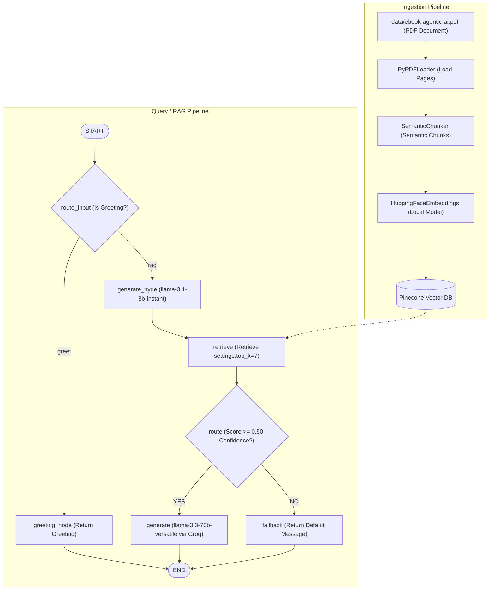

# Agentic AI PDF RAG Chatbot (Groq + Local HuggingFace Embeddings)

A strict, production-ready Retrieval-Augmented Generation (RAG) chatbot built using **LangGraph** for workflow orchestration, **Pinecone** for vector search, **Groq API** (`llama-3.3-70b-versatile`) for ultra-fast inference, and a **Streamlit** user interface.

Strict grounding is enforced: if the retrieved context does not contain the answer, the LLM will fall back and refuse to hallucinate.

---

## Features

- **Ingestion Pipeline:** Reads the Agentic AI PDF, chunks it semantically based on sentence embedding differences, generates local embeddings, and uploads vectors to Pinecone.
- **LangGraph Orchestration:** A state graph controls the flow of context retrieval, similarity confidence threshold routing, and response generation.
- **Strict Grounding:** The assistant will refuse to answer using outside knowledge if the context is weak (similarity score < 0.55).
- **Dual Interfaces:** Contains both a **FastAPI REST API** backend and a native **Streamlit Chat UI** frontend.
- **Full Traceability:** The response returns:
  - The final answer
  - The retrieved context chunks (text, source path, page number, and confidence score)
  - The overall confidence score

---

## Setup & Running

This project requires **Python 3.13.14** (or any version `>= 3.12` and `< 3.14`).

### 1) Create Environment & Install Dependencies

```bash
# Create a virtual environment (ensure Python 3.13.x is used)
python -m venv .venv

# Activate virtual environment
.venv\Scripts\activate

# Install requirements
pip install -r requirements.txt
```

### 2) Configuration (.env)

Create a `.env` file in the root directory (based on `.env.example`) and fill in your credentials:

```env
GROQ_API_KEY="your_groq_api_key"
PINECONE_API_KEY="your_pinecone_api_key"
HF_HUB_OFFLINE=1
```

### 3) Ingest the PDF

Place the PDF file at `data/ebook-agentic-ai.pdf` and run the ingestion script:

```bash
python -m rag.ingest
```

### 4) Running the Application

You can interact with the chatbot in two ways:

#### A) Streamlit Frontend UI (Recommended)
Launch the interactive chat interface directly:
```bash
streamlit run streamlit_app.py
```

#### B) FastAPI Backend REST API
Launch the FastAPI server (accessible at `http://127.0.0.1:8000` with Swagger docs at `/docs`):
```bash
uvicorn api.main:app --reload
```

---

## Architecture Overview

The system is split into two components: the Ingestion Pipeline and the Query/RAG Pipeline.



### LangGraph Design Details
- **`RagState`:** Manages graph state variables (query, context, similarity score, final answer).
- **`route_input` (Edge):** Uses `llama-3.1-8b-instant` to route greetings to `greeting_node` and content queries to `generate_hyde`.
- **`greeting_node`:** Instantly returns a static greeting message.
- **`generate_hyde`:** Uses `llama-3.1-8b-instant` to produce a hypothetical answering passage (`search_query`).
- **`retrieve`:** Queries Pinecone with the HyDE document to retrieve the top 7 matching chunks.
- **`route` (Edge):** Directs to `generate` if the top similarity score is `≥ 0.50`, otherwise falls back to `fallback`.
- **`generate`:** Formulates the final response using `llama-3.3-70b-versatile` with the retrieved chunks.
- **`fallback`:** Returns the standard out-of-context fallback message.

---

## Sample Queries

1. **`How agentic AI and LLMs work together`**
2. **`Discuss terminology maze in agentic AI`**
3. **`What are some Agentic AI Use cases`**
4. **`What are the defining characteristics of Agentic AI`**
5. **`What Are Multi-Agent Systems?`**
6. **`List all layers in agentic AI system`**
7. **`What do you mean by orchestration in AI agents`**
8. **`What are the challenges of Orchestrating Complex Agentic Systems`**
